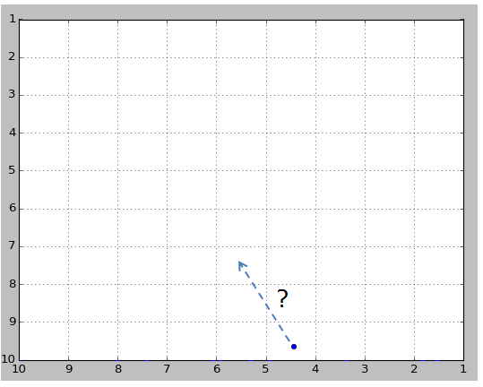
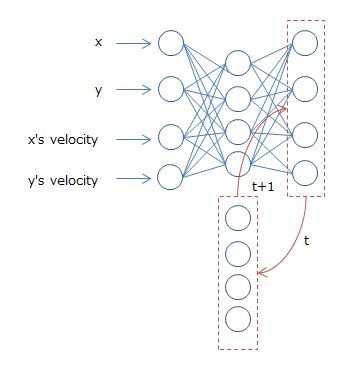

# Recurrent Neural Network Demo by [PyBrain](http://pybrain.org/docs/index.html)

## Purpose
To predict the path of bouncing ball in 10x10 area.



## Model
Elman/Jordan Network (below is Jordan model).

input: x,y position and velocity.



## Training Data
Generated bouncing ball data from `data/ball_data.py`.

## How to run
After install and activate virtual environment, run below.

```
python rnn_demo.py
```

(Default is Jordan, if you want to run Elman, add `E` option).

The dependencies are below.

* numpy
* scipy
* matplotlib
* [Pybrain](https://github.com/pybrain/pybrain/wiki/Installation)
